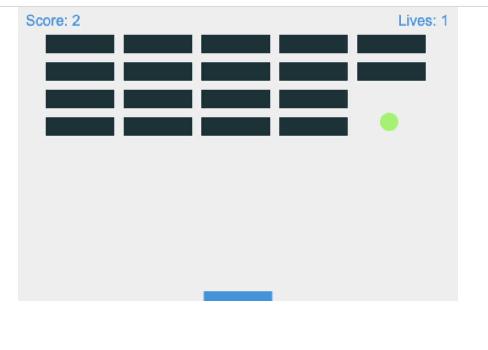

# Breakout Game

I created a simple classic Breakout game written entirely in pure JavaScript and rendered on HTML <canvas> following the
[mdn web docs tutorial](https://developer.mozilla.org/en-US/docs/Games/Tutorials/2D_Breakout_game_pure_JavaScript). 
I have refactored the code to include the Object-oriented-programming (OOP) in this assignment.

